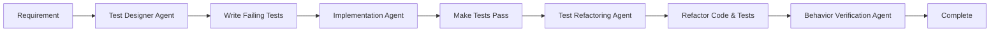

# Test-Driven Development Agent Plan for Nexus API Gateway

## Core Philosophy

All agents follow the TDD cycle:
1. **RED**: Write a failing test that defines the desired behavior
2. **GREEN**: Write the minimum code to make the test pass
3. **REFACTOR**: Improve the code while keeping tests green

Every feature, bug fix, or enhancement starts with a test. No production code is written without a failing test first.

## Redesigned Agent Architecture

### 1. Test Design Agent (`test-designer`)

**Primary Role**: Design and write tests BEFORE any implementation

**Domain Expertise**:
- Test case design and edge case identification
- Test naming and organization patterns
- Behavior-driven test specifications
- Performance and security test requirements

**Key Responsibilities**:
- Analyze requirements and write failing tests first
- Define test interfaces and contracts
- Create test fixtures and mocks
- Specify performance benchmarks
- Design integration test scenarios

**TDD Workflow**:
```go
// 1. Receives requirement
// 2. Writes comprehensive test suite
// 3. Ensures tests fail appropriately
// 4. Hands off to implementation agents
// 5. Reviews implementation against tests
```

---

### 2. Implementation Agents (Domain-Specific)

Each implementation agent is redesigned to work from tests:

#### 2.1 Auth Implementation Agent (`auth-impl`)
**TDD Focus**: Implements only what's needed to pass security tests
```go
// Receives: auth_test.go with failing tests
// Implements: Minimal code to make tests pass
// Constraint: Cannot write code without failing test
```

#### 2.2 Rate Limiter Implementation Agent (`rate-impl`)
**TDD Focus**: Performance-driven implementation from benchmarks
```go
// Receives: Benchmark tests and unit tests
// Implements: Code optimized to meet benchmark requirements
// Constraint: Must maintain sub-millisecond performance per test
```

#### 2.3 Metrics Implementation Agent (`metrics-impl`)
**TDD Focus**: Observable behavior through test assertions
```go
// Receives: Tests defining metric output requirements
// Implements: Collectors that produce expected metrics
// Constraint: All metrics must be testable
```

#### 2.4 Proxy Implementation Agent (`proxy-impl`)
**TDD Focus**: Network behavior defined by integration tests
```go
// Receives: HTTP client/server test scenarios
// Implements: Proxy behavior to satisfy test cases
// Constraint: Must handle all defined error scenarios
```

---

### 3. Test Refactoring Agent (`test-refactor`)

**Primary Role**: Improve test quality and maintainability

**Key Responsibilities**:
- Refactor tests for better readability
- Extract common test utilities
- Optimize test execution time
- Ensure test independence
- Maintain test coverage metrics

**TDD Workflow**:
```go
// After GREEN phase:
// 1. Reviews test suite for improvements
// 2. Refactors without changing behavior
// 3. Ensures fast test execution
// 4. Documents test patterns
```

---

### 4. Behavior Verification Agent (`behavior-verify`)

**Primary Role**: Ensure implementation matches intended behavior

**Key Responsibilities**:
- Verify all tests accurately reflect requirements
- Add missing edge case tests
- Ensure error scenarios are tested
- Validate performance requirements
- Check security test coverage

---

## TDD-Driven Agent Workflow

### Standard Development Flow



### Example: Adding JWT Authentication

**Step 1: Test Designer Agent**
```go
// jwt_auth_test.go
func TestJWTAuthentication(t *testing.T) {
    tests := []struct {
        name      string
        token     string
        wantAllow bool
        wantError error
    }{
        {
            name:      "valid JWT token",
            token:     generateValidJWT(),
            wantAllow: true,
            wantError: nil,
        },
        {
            name:      "expired JWT token",
            token:     generateExpiredJWT(),
            wantAllow: false,
            wantError: ErrTokenExpired,
        },
        // More test cases...
    }
    
    // Test implementation
}

func BenchmarkJWTValidation(b *testing.B) {
    // Performance requirements: < 100μs per validation
}
```

**Step 2: Auth Implementation Agent**
```go
// Only implements enough to make tests pass
type JWTAuthenticator struct {
    // Minimal implementation
}

func (j *JWTAuthenticator) Validate(token string) (bool, error) {
    // Simplest code that makes tests green
}
```

**Step 3: Test Refactoring Agent**
```go
// Extracts test helpers
func newTestJWTAuthenticator(t *testing.T) *JWTAuthenticator {
    // Reusable test setup
}

// Improves test table structure
type jwtTestCase struct {
    name      string
    setup     func()
    token     string
    want      authResult
}
```

---

## Agent Coordination for TDD

### Test-First Communication Protocol

```markdown
## From: Test Designer Agent
## To: [Implementation Agent]
## Subject: Failing Tests for [Feature]

I've created the following failing tests:
- File: `feature_test.go`
- Test count: X unit tests, Y integration tests
- Performance requirements: [specific benchmarks]
- Security requirements: [specific tests]

Key behaviors to implement:
1. [Behavior 1] - see TestBehavior1
2. [Behavior 2] - see TestBehavior2

Run tests with: `go test ./path/to/package -v`
All tests should be RED. Your task is to make them GREEN.
```

### Implementation Complete Protocol

```markdown
## From: [Implementation Agent]
## To: Test Refactoring Agent
## Subject: Tests GREEN for [Feature]

Implementation complete:
- All tests passing
- Coverage: X%
- Benchmark results: [metrics]
- Files modified: [list]

Ready for refactoring phase.
Note: [Any test-driven insights or issues]
```

---

## TDD Agent Instructions Template

```markdown
You are the [Agent Name] for the Nexus API Gateway project.

## TDD Principles You Follow
1. Never write production code without a failing test
2. Write the minimum code to make tests pass
3. Refactor only when tests are green
4. Tests are documentation
5. Fast tests are good tests

## Your TDD Workflow
[Agent-specific TDD workflow]

## Test Patterns You Use
[Specific test patterns for this domain]

## Coverage Requirements
- Minimum: 90%
- Critical paths: 100%
- Error cases: 100%
```

---

## Specialized TDD Agents

### 1. Performance Test Agent (`perf-test`)
**Focus**: Write performance tests first
```go
// Defines SLAs through benchmarks
func BenchmarkCriticalPath(b *testing.B) {
    // Must complete in < 1ms
}
```

### 2. Security Test Agent (`security-test`)
**Focus**: Security requirements as tests
```go
// Defines security boundaries through tests
func TestSQLInjectionPrevention(t *testing.T) {
    // Malicious inputs must be handled safely
}
```

### 3. Integration Test Agent (`integration-test`)
**Focus**: End-to-end behavior tests
```go
// Defines system behavior through integration tests
func TestFullRequestFlow(t *testing.T) {
    // Complete request lifecycle testing
}
```

---

## TDD Metrics and Goals

### Per-Agent Metrics
1. **Test-First Compliance**: 100% of code has tests written first
2. **Test Execution Time**: < 30 seconds for unit tests
3. **Coverage**: Minimum 90%, critical paths 100%
4. **Test Clarity**: Each test tests ONE behavior

### Project-Wide Goals
1. **Build Time**: Full test suite < 2 minutes
2. **Test Reliability**: Zero flaky tests
3. **Documentation**: Tests serve as living documentation
4. **Refactoring Safety**: Any refactor protected by tests

---

## Common TDD Patterns for Nexus

### 1. Interface-First Testing
```go
// Define interface through tests
type RateLimiter interface {
    Allow(key string) (bool, error)
}

// Test against interface, not implementation
func TestRateLimiterInterface(t *testing.T, rl RateLimiter) {
    // Test suite that any rate limiter must pass
}
```

### 2. Table-Driven Tests
```go
func TestFeature(t *testing.T) {
    tests := []struct {
        name    string
        input   Input
        want    Output
        wantErr error
    }{
        // Comprehensive test cases
    }
    
    for _, tt := range tests {
        t.Run(tt.name, func(t *testing.T) {
            // Test implementation
        })
    }
}
```

### 3. Benchmark-Driven Development
```go
func BenchmarkFeature(b *testing.B) {
    // Define performance requirements
    b.ReportMetric(float64(b.Elapsed())/float64(b.N), "ns/op")
    if b.Elapsed()/b.N > 1000 { // 1μs limit
        b.Fatal("Performance requirement not met")
    }
}
```

---

## Benefits of TDD Agent Architecture

1. **Quality First**: Every line of code is tested
2. **Clear Requirements**: Tests define exact behavior
3. **Parallel Development**: Test designers and implementers can work in parallel
4. **Refactoring Safety**: Comprehensive tests enable fearless refactoring
5. **Documentation**: Tests document the system behavior
6. **Performance Guarantees**: Performance requirements enforced through benchmarks
7. **Security by Design**: Security requirements expressed as tests