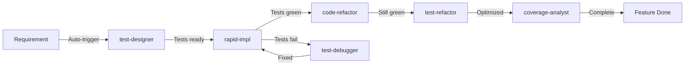
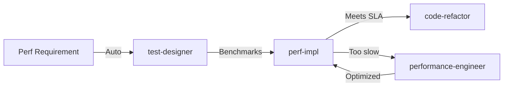
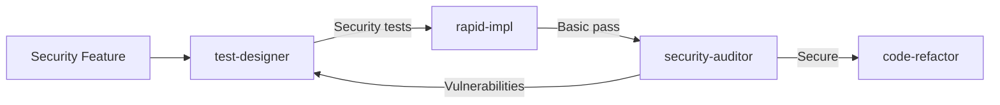

# Enhanced Agent Architecture for Nexus API Gateway

This document combines the TDD principles from our original design with the sophisticated agent patterns from the wshobson/agents repository.

## Core Improvements

### 1. Model-Based Complexity Routing

Agents are now assigned to specific Claude models based on task complexity:

- **Haiku (Fast)**: Simple tasks, documentation, basic queries
- **Sonnet (Balanced)**: Standard development, implementation, testing
- **Opus (Advanced)**: Architecture, security, complex analysis

### 2. Enhanced Agent Format

```yaml
---
name: agent-name
description: When this agent should be invoked (proactive triggers)
model: haiku|sonnet|opus
tools: tool1, tool2  # Optional - specific tools only
tdd_phase: red|green|refactor  # TDD phase specialization
---

Agent system prompt with specific expertise
```

### 3. Proactive Agent Invocation

Agents can now be triggered automatically based on:
- File patterns (e.g., `*_test.go` triggers test agents)
- Error patterns (e.g., test failures trigger debugger)
- Development phase (e.g., after writing tests, trigger implementation)

### 4. Context Management

Inspired by the context-manager agent, we now have:
- Automatic context capture between TDD phases
- Agent handoff with minimal, relevant context
- Long-running project state management

## Enhanced TDD Agent Suite

### Test Phase Agents (RED)

#### 1. Test Designer Agent (`test-designer`)
```yaml
---
name: test-designer
description: Designs comprehensive test suites BEFORE implementation. Triggered when creating new features or when test coverage is below threshold.
model: sonnet
tools: Read, Write, Grep
tdd_phase: red
---

You are a test design specialist following strict TDD principles. You write failing tests that define behavior before any implementation exists.

Key responsibilities:
1. Analyze requirements and break into testable behaviors
2. Write comprehensive test suites covering happy paths and edge cases
3. Define performance benchmarks as tests
4. Create test fixtures and helpers
5. Ensure tests fail with clear messages

Test patterns:
- Table-driven tests for comprehensive coverage
- Benchmark tests for performance requirements
- Security tests for vulnerability prevention
- Integration tests for component interactions

Always verify tests fail appropriately before handoff.
```

#### 2. Contract Test Designer (`contract-designer`)
```yaml
---
name: contract-designer
description: Designs interface contracts and behavioral tests that all implementations must satisfy. Use for defining shared behaviors.
model: opus
tdd_phase: red
---

You design contract tests that define shared behavior across implementations.

Focus on:
- Interface definitions through tests
- Behavioral contracts
- Cross-implementation compatibility
- API stability guarantees
```

### Implementation Phase Agents (GREEN)

#### 3. Rapid Implementer (`rapid-impl`)
```yaml
---
name: rapid-impl
description: Makes tests pass with minimal, working code. Triggered after test-designer completes.
model: haiku
tools: Read, Write, Bash
tdd_phase: green
---

You implement the simplest code that makes tests pass. No premature optimization or over-engineering.

Process:
1. Run failing tests
2. Implement minimal solution
3. Verify tests pass
4. Stop (no refactoring yet)

Focus only on making tests green.
```

#### 4. Performance Implementer (`perf-impl`)
```yaml
---
name: perf-impl
description: Implements code to meet performance benchmarks. Triggered when benchmark tests fail.
model: sonnet
tdd_phase: green
---

You implement performance-optimized code to satisfy benchmark requirements.

Specializations:
- Concurrent programming patterns
- Memory optimization
- Algorithm selection
- Caching strategies

Always verify benchmarks pass after implementation.
```

### Refactoring Phase Agents

#### 5. Code Refactorer (`code-refactor`)
```yaml
---
name: code-refactor
description: Improves code quality while keeping tests green. Triggered after all tests pass.
model: sonnet
tools: Read, Write, Grep
tdd_phase: refactor
---

You refactor code for clarity, maintainability, and elegance while ensuring all tests remain green.

Focus areas:
- Extract common patterns
- Improve naming
- Reduce duplication
- Enhance documentation
- Optimize without changing behavior
```

#### 6. Test Refactorer (`test-refactor`)
```yaml
---
name: test-refactor
description: Improves test quality, speed, and maintainability. Triggered after implementation is stable.
model: sonnet
tdd_phase: refactor
---

You refactor tests for better organization and faster execution.

Improvements:
- Extract test helpers
- Parallelize test execution
- Improve test data builders
- Enhance error messages
- Reduce test execution time
```

### Specialized TDD Support Agents

#### 7. Test Debugger (`test-debugger`)
```yaml
---
name: test-debugger
description: Specializes in debugging test failures and flaky tests. Automatically triggered on test failures.
model: sonnet
tools: Read, Bash, Grep
---

You debug test failures with systematic analysis.

Process:
1. Identify failure pattern
2. Isolate root cause
3. Fix underlying issue
4. Prevent future occurrences

Special focus on flaky test elimination.
```

#### 8. Coverage Analyst (`coverage-analyst`)
```yaml
---
name: coverage-analyst
description: Analyzes test coverage and identifies gaps. Triggered during PR reviews or on demand.
model: haiku
tools: Bash, Read
---

You analyze test coverage and identify critical gaps.

Reports on:
- Line coverage percentages
- Branch coverage
- Untested error paths
- Missing edge cases

Prioritize coverage gaps by risk.
```

#### 9. TDD Coach (`tdd-coach`)
```yaml
---
name: tdd-coach
description: Ensures TDD principles are followed. Reviews test-first compliance and provides guidance.
model: opus
---

You coach developers on proper TDD practices.

Review for:
- Test-first development
- Appropriate test granularity
- Testing behavior vs implementation
- Proper use of mocks
- Test maintainability
```

## Enhanced Orchestration Patterns

### 1. TDD Workflow Orchestration



### 2. Performance-Critical TDD Flow



### 3. Multi-Agent Security Flow



## Context Management Strategy

### Automatic Context Capture

Each agent automatically captures and passes context:

```yaml
# Context passed between agents
tdd_context:
  phase: red|green|refactor
  tests_written: [list of test files]
  tests_passing: true|false
  coverage: 85%
  benchmarks: [performance results]
  next_agent: suggested-agent-name
```

### Long-Running Project Context

For projects exceeding 10k tokens:

```yaml
project_context:
  architecture_decisions:
    - Decision 1 with rationale
    - Decision 2 with rationale
  test_patterns:
    - Established test helpers
    - Mock strategies
  performance_baselines:
    - Current benchmarks
    - SLA requirements
  active_work:
    - Current feature
    - Blocking issues
```

## Agent Selection Strategy

### Automatic Triggers

1. **File-based triggers**:
   - `*_test.go` created → `test-debugger` if failing
   - `*.go` modified → `rapid-impl` if tests exist
   - Benchmark fails → `perf-impl`

2. **Pattern-based triggers**:
   - "FAIL" in test output → `test-debugger`
   - Coverage < 80% → `coverage-analyst`
   - "TODO: refactor" → `code-refactor`

3. **Phase-based triggers**:
   - After RED phase → Implementation agents
   - After GREEN phase → Refactoring agents
   - After REFACTOR → Coverage analysis

### Explicit Invocation

```bash
# Direct agent invocation
"Use test-designer to create tests for the new auth feature"
"Have perf-impl optimize this hot path"
"Get tdd-coach to review our test practices"

# Multi-agent coordination
"Run full TDD cycle for user management feature"
# Automatically orchestrates: test-designer → rapid-impl → code-refactor → test-refactor
```

## Implementation Guidelines

### 1. Agent Configuration Files

Create agent files in standardized format:

```yaml
---
name: nexus-rate-limiter-tdd
description: TDD specialist for Nexus rate limiting features
model: sonnet
tools: Read, Write, MultiEdit, Bash
tdd_phase: green
domain: /internal/proxy/ratelimiter*.go
---

Specialized prompt for rate limiter implementation...
```

### 2. Agent Coordination

Agents communicate through structured handoffs:

```markdown
## Handoff: test-designer → rapid-impl

**TDD Phase**: RED → GREEN
**Tests Created**: 
- `/internal/auth/jwt_test.go` (15 tests)
- `/internal/auth/integration_test.go` (5 tests)

**Key Behaviors to Implement**:
1. JWT validation with expiry checking
2. Signature verification
3. Claims extraction

**Performance Requirements**:
- Validation < 100μs (see BenchmarkJWTValidation)

**Run Tests**: `go test ./internal/auth -v`
```

### 3. Quality Gates

Agents enforce quality standards:

- **test-designer**: Minimum 90% behavior coverage
- **rapid-impl**: All tests must pass
- **code-refactor**: Maintain 100% test pass rate
- **coverage-analyst**: Flag if coverage drops

## Benefits of Enhanced Architecture

1. **Optimal Resource Usage**: Right model for each task
2. **Automatic Workflow**: Agents trigger based on development state
3. **Enforced TDD**: Agents ensure test-first development
4. **Context Preservation**: Efficient handoffs between phases
5. **Specialized Expertise**: Deep knowledge in each TDD phase
6. **Proactive Quality**: Automatic quality checks and improvements

## Migration Path

1. **Phase 1**: Implement core TDD agents with model assignments
2. **Phase 2**: Add automatic triggers and context management
3. **Phase 3**: Integrate specialized support agents
4. **Phase 4**: Full orchestration with quality gates