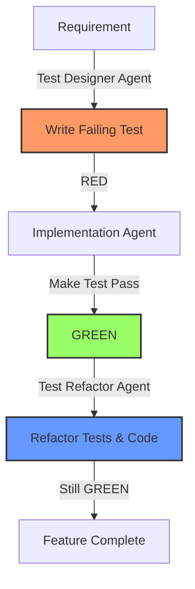

# TDD Workflow Guide for Nexus API Gateway

## The TDD Cycle



## Example: Adding Request Retry Feature

### Phase 1: Test Designer Agent (RED)

**Requirement**: "Add automatic retry for failed upstream requests with exponential backoff"

```go
// retry_test.go
package proxy_test

import (
    "net/http"
    "testing"
    "time"
)

func TestRequestRetry_RetriesFailedRequests(t *testing.T) {
    // Given: A proxy with retry enabled
    attempts := 0
    mockUpstream := newMockServer(func(w http.ResponseWriter, r *http.Request) {
        attempts++
        if attempts < 3 {
            w.WriteHeader(http.StatusServiceUnavailable)
            return
        }
        w.WriteHeader(http.StatusOK)
    })
    defer mockUpstream.Close()
    
    proxy := NewProxy(WithRetry(3, 100*time.Millisecond))
    
    // When: Making a request
    resp := proxy.Do(newTestRequest())
    
    // Then: Should succeed after retries
    assert.Equal(t, http.StatusOK, resp.StatusCode)
    assert.Equal(t, 3, attempts, "should retry twice before succeeding")
}

func TestRequestRetry_UsesExponentialBackoff(t *testing.T) {
    // Test that retry delays increase exponentially
    timings := []time.Duration{}
    
    mockUpstream := newMockServerWithTiming(func(w http.ResponseWriter, r *http.Request) {
        timings = append(timings, time.Since(lastRequest))
        w.WriteHeader(http.StatusServiceUnavailable)
    })
    
    proxy := NewProxy(WithRetry(3, 100*time.Millisecond))
    proxy.Do(newTestRequest())
    
    // Verify exponential backoff
    assert.True(t, timings[1] > timings[0]*1.5, "second delay should be ~2x first")
    assert.True(t, timings[2] > timings[1]*1.5, "third delay should be ~2x second")
}

func TestRequestRetry_DoesNotRetryNonRetriableErrors(t *testing.T) {
    tests := []struct {
        name       string
        statusCode int
        wantRetry  bool
    }{
        {"400 Bad Request", http.StatusBadRequest, false},
        {"401 Unauthorized", http.StatusUnauthorized, false},
        {"500 Server Error", http.StatusInternalServerError, true},
        {"503 Service Unavailable", http.StatusServiceUnavailable, true},
        {"504 Gateway Timeout", http.StatusGatewayTimeout, true},
    }
    
    for _, tt := range tests {
        t.Run(tt.name, func(t *testing.T) {
            attempts := 0
            mockUpstream := newMockServer(func(w http.ResponseWriter, r *http.Request) {
                attempts++
                w.WriteHeader(tt.statusCode)
            })
            
            proxy := NewProxy(WithRetry(3, 10*time.Millisecond))
            proxy.Do(newTestRequest())
            
            expectedAttempts := 1
            if tt.wantRetry {
                expectedAttempts = 3
            }
            
            assert.Equal(t, expectedAttempts, attempts)
        })
    }
}

func BenchmarkRequestRetry_NoRetryNeeded(b *testing.B) {
    // Performance when no retry is needed should be < 1ms overhead
    mockUpstream := newMockServer(func(w http.ResponseWriter, r *http.Request) {
        w.WriteHeader(http.StatusOK)
    })
    
    proxyWithRetry := NewProxy(WithRetry(3, 100*time.Millisecond))
    proxyWithoutRetry := NewProxy()
    
    b.Run("WithRetry", func(b *testing.B) {
        for i := 0; i < b.N; i++ {
            proxyWithRetry.Do(newTestRequest())
        }
    })
    
    b.Run("WithoutRetry", func(b *testing.B) {
        for i := 0; i < b.N; i++ {
            proxyWithoutRetry.Do(newTestRequest())
        }
    })
    
    // Verify overhead is minimal
}
```

**Handoff to Implementation Agent:**
```markdown
## Failing Tests Ready: Request Retry Feature

Tests created in: `internal/proxy/retry_test.go`

Key behaviors to implement:
1. Retry failed requests (500, 503, 504 status codes)
2. Use exponential backoff between retries
3. Do not retry client errors (4xx)
4. Maximum retry count configurable
5. Performance overhead < 1ms when no retry needed

Run with: `go test ./internal/proxy -run Retry -v`
```

### Phase 2: Implementation Agent (GREEN)

```go
// retry.go
package proxy

import (
    "math"
    "net/http"
    "time"
)

type RetryConfig struct {
    MaxAttempts int
    BaseDelay   time.Duration
}

type retryTransport struct {
    base   http.RoundTripper
    config RetryConfig
}

func (t *retryTransport) RoundTrip(req *http.Request) (*http.Response, error) {
    var resp *http.Response
    var err error
    
    for attempt := 0; attempt < t.config.MaxAttempts; attempt++ {
        // Clone request for each attempt
        if attempt > 0 {
            delay := t.calculateBackoff(attempt)
            time.Sleep(delay)
        }
        
        resp, err = t.base.RoundTrip(req)
        
        // Check if we should retry
        if err == nil && !t.shouldRetry(resp.StatusCode) {
            return resp, nil
        }
        
        // Close response body if retrying
        if resp != nil && resp.Body != nil {
            resp.Body.Close()
        }
    }
    
    return resp, err
}

func (t *retryTransport) shouldRetry(statusCode int) bool {
    switch statusCode {
    case http.StatusInternalServerError,
         http.StatusBadGateway,
         http.StatusServiceUnavailable,
         http.StatusGatewayTimeout:
        return true
    default:
        return false
    }
}

func (t *retryTransport) calculateBackoff(attempt int) time.Duration {
    // Exponential backoff: baseDelay * 2^attempt
    multiplier := math.Pow(2, float64(attempt-1))
    return time.Duration(float64(t.config.BaseDelay) * multiplier)
}

// Integration with proxy
func WithRetry(maxAttempts int, baseDelay time.Duration) ProxyOption {
    return func(p *Proxy) {
        p.client.Transport = &retryTransport{
            base:   p.client.Transport,
            config: RetryConfig{
                MaxAttempts: maxAttempts,
                BaseDelay:   baseDelay,
            },
        }
    }
}
```

**All tests GREEN! Handoff to Test Refactor Agent:**
```markdown
## Implementation Complete: Request Retry

All retry tests passing:
- Basic retry functionality ✓
- Exponential backoff ✓
- Non-retriable errors ✓
- Performance benchmark ✓

Ready for refactoring phase.
```

### Phase 3: Test Refactor Agent (REFACTOR)

```go
// retry_test_helpers.go
package proxy_test

// Extract common test helpers
type retryTestServer struct {
    *httptest.Server
    attempts      int
    recordTimings bool
    timings       []time.Time
}

func newRetryTestServer(opts ...retryServerOption) *retryTestServer {
    s := &retryTestServer{
        timings: []time.Time{},
    }
    
    for _, opt := range opts {
        opt(s)
    }
    
    s.Server = httptest.NewServer(http.HandlerFunc(s.handler))
    return s
}

func (s *retryTestServer) handler(w http.ResponseWriter, r *http.Request) {
    s.attempts++
    if s.recordTimings {
        s.timings = append(s.timings, time.Now())
    }
    
    // Configurable response logic
    if s.responseFunc != nil {
        s.responseFunc(w, r, s.attempts)
    }
}

// Test fixture for retry scenarios
type RetryTestFixture struct {
    AlwaysFails      func() *retryTestServer
    FailsTwice       func() *retryTestServer
    SucceedsOnThird  func() *retryTestServer
    ClientError      func(code int) *retryTestServer
    ServerError      func(code int) *retryTestServer
}

func NewRetryTestFixture() *RetryTestFixture {
    return &RetryTestFixture{
        AlwaysFails: func() *retryTestServer {
            return newRetryTestServer(
                withResponse(http.StatusServiceUnavailable),
            )
        },
        FailsTwice: func() *retryTestServer {
            return newRetryTestServer(
                withConditionalResponse(func(attempt int) int {
                    if attempt <= 2 {
                        return http.StatusServiceUnavailable
                    }
                    return http.StatusOK
                }),
            )
        },
        // ... more fixtures
    }
}

// Refactored test using fixtures
func TestRequestRetry_RetriesFailedRequests_Refactored(t *testing.T) {
    t.Parallel()
    
    fixtures := NewRetryTestFixture()
    server := fixtures.FailsTwice()
    defer server.Close()
    
    proxy := NewProxy(
        WithRetry(3, fastBackoff), // extracted constant
        WithUpstream(server.URL),
    )
    
    resp := proxy.Do(newTestRequest())
    
    assert.Equal(t, http.StatusOK, resp.StatusCode)
    assert.Equal(t, 3, server.Attempts(), "should retry twice before succeeding")
}

// Parallel test execution
func TestRetryScenarios(t *testing.T) {
    t.Parallel()
    
    scenarios := []struct {
        name          string
        setupServer   func() *retryTestServer
        wantAttempts  int
        wantStatus    int
    }{
        {
            name:         "succeeds without retry",
            setupServer:  fixtures.AlwaysSucceeds,
            wantAttempts: 1,
            wantStatus:   http.StatusOK,
        },
        {
            name:         "retries on 503",
            setupServer:  fixtures.ServerError(503),
            wantAttempts: 3,
            wantStatus:   http.StatusServiceUnavailable,
        },
        // More scenarios...
    }
    
    for _, sc := range scenarios {
        sc := sc // capture range variable
        t.Run(sc.name, func(t *testing.T) {
            t.Parallel()
            
            server := sc.setupServer()
            defer server.Close()
            
            proxy := NewProxy(WithRetry(3, fastBackoff))
            resp := proxy.Do(newTestRequest())
            
            assert.Equal(t, sc.wantStatus, resp.StatusCode)
            assert.Equal(t, sc.wantAttempts, server.Attempts())
        })
    }
}
```

## TDD Best Practices for Nexus

### 1. Test Naming Convention
```go
// Pattern: Test{Component}_{Scenario}_{ExpectedBehavior}
func TestRateLimiter_WhenBurstExceeded_RejectsRequest(t *testing.T)
func TestAuth_WithExpiredToken_ReturnsUnauthorized(t *testing.T)
func TestMetrics_AfterSuccessfulRequest_IncrementsCounter(t *testing.T)
```

### 2. Benchmark-Driven Performance
```go
// Define performance requirements as benchmarks
func BenchmarkCriticalPath(b *testing.B) {
    // Setup
    proxy := setupTestProxy(b)
    
    b.ResetTimer()
    b.ReportAllocs()
    
    for i := 0; i < b.N; i++ {
        proxy.Do(testRequest)
    }
    
    // Assert performance requirements
    opsPerSec := float64(b.N) / b.Elapsed().Seconds()
    if opsPerSec < 10000 {
        b.Fatalf("Performance requirement not met: %.2f ops/sec < 10000", opsPerSec)
    }
}
```

### 3. Contract Testing
```go
// Define contracts that all implementations must satisfy
type RateLimiterContract interface {
    // Test suite that any rate limiter must pass
    TestAllow(t *testing.T, rl RateLimiter)
    TestReset(t *testing.T, rl RateLimiter)
    TestConcurrency(t *testing.T, rl RateLimiter)
}

// Apply contract to implementations
func TestTokenBucketRateLimiter(t *testing.T) {
    rl := NewTokenBucketRateLimiter()
    contract := &RateLimiterContractTests{}
    
    t.Run("Allow", func(t *testing.T) {
        contract.TestAllow(t, rl)
    })
    // Run all contract tests
}
```

## TDD Metrics Dashboard

Track TDD health metrics:

1. **Test-First Compliance**: % of commits with test changes before implementation
2. **Test Execution Time**: Time to run full test suite
3. **Test Stability**: Flaky test count
4. **Coverage Trends**: Coverage % over time
5. **Test-to-Code Ratio**: Lines of test code vs production code

## Quick Commands

```bash
# TDD Development Flow
go test ./... -run TestNewFeature -v    # 1. See test fail (RED)
# Implement feature
go test ./... -run TestNewFeature -v    # 2. See test pass (GREEN)
# Refactor
go test ./... -v                        # 3. All tests still pass

# Run specific test phases
go test -short                          # Fast tests only
go test -bench=.                        # Performance tests
go test -race                           # Concurrency tests
go test -cover                          # Coverage report

# Watch mode for TDD
# Install: go install github.com/cespare/reflex@latest
reflex -r '\.go$' -- go test ./... -v
```

Remember: In TDD, the test writes the code. Let failing tests guide your implementation.